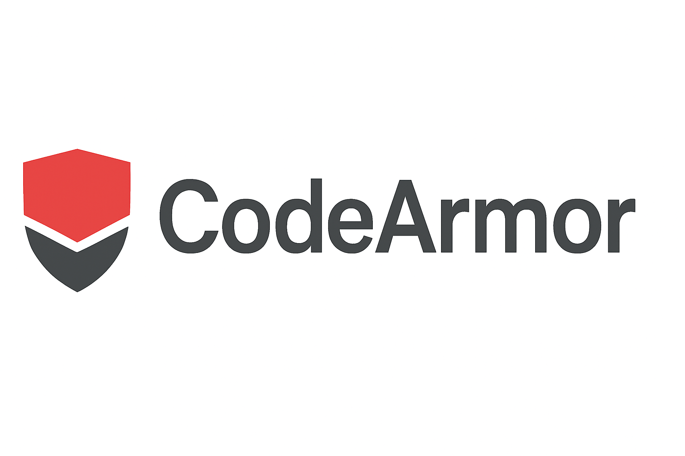

  

CodeArmor
License: MIT | Release: 1.0.0 | Contributions: Welcome

About
CodeArmor is a Visual Studio extension that helps developers detect and fix security vulnerabilities directly in their IDE. It parses code for common weaknesses like hard-coded secrets, unsafe input, and insecure patterns. The extension provides actionable fixes and links to trusted resources, empowering developers to write secure code safely and efficiently with minimal performance impact.

Key Features
CodeArmor offers several key advantages for secure development: Seamless Integration (works directly within Visual Studio), Rule-Based Analysis (checks for injection, deserialization, secrets management, and more), Actionable Guidance (provides explanations and secure coding suggestions with resource links), and is Lightweight & Fast (runs in real-time as you code).

Quickstart
Prerequisites: Ensure Node.js is installed, then run npm install. Installation: Install CodeArmor from the Visual Studio Marketplace or load it locally. Running: Open your project in Visual Studio, navigate to the Run and Debug sidebar, and select Launch Extension. A new VS instance will open. Debugging: Set breakpoints in your extension code and view logs in the Debug Console. Stop debugging by closing the launched instance.

Security Rules
CodeArmor analyzes code across key categories: Injection Prevention (detects unsafe eval(), dynamic script injection, etc.), Deserialization Safety (catches unsafe JSON.parse(), prototype pollution, and untrusted object creation), Secrets Management (flags hardcoded credentials and API keys), Input Validation (highlights unvalidated or unsanitized user input), and Configuration Hardening (identifies insecure defaults and weak CORS settings).

Contributing & License
Contributing: Please refer to our Contributing Guide.

License: This project is under the MIT License.

| Name            | GitHub      | LinkedIn      |
| --------------- | ----------- | ------------- |
| Thin Thin Khine | [GitHub](#) | [LinkedIn](#) |
| Kevin Wu        | [GitHub](#) | [LinkedIn](#) |
| Peter Tan-Gatue | [GitHub](#) | [LinkedIn](#) |
| Michal Marrow   | [GitHub](#) | [LinkedIn](#) |
